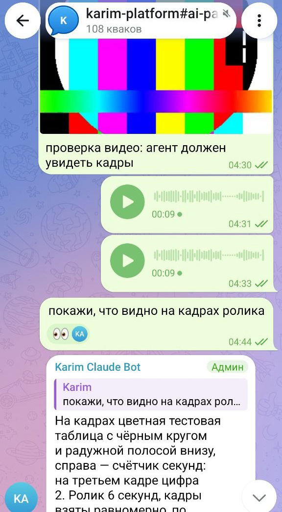
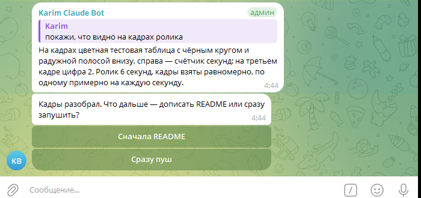

# claude-telegram-chat

Двусторонний канал между Telegram и **работающей** сессией Claude Code.

Пишете в тему задачи — сообщение доходит до агента **посреди работы**, он отвечает туда же, не прекращая её. Не «Claude в телеграме», где бот запускает новую сессию, а разговор с тем агентом, который прямо сейчас правит ваш код в терминале.

**Главное: всё живёт в одной группе с темами, и каждая тема — свой запущенный Claude Code.** Сколько сессий идёт параллельно, столько и тем: в одной вы разбираете бота, в другой игру, в третьей инфраструктуру — ответы не смешиваются, потому что каждая сессия читает только свою ленту. Переключение между задачами превращается в переключение темы на телефоне, а вся переписка по задаче остаётся в ней и после перезапуска сессии.

<table>
<tr>
<td width="38%"></td>
<td width="62%"></td>
</tr>
</table>

Слева — тема с телефона: ролик разобран на кадры, голосовые распознаны, 👀 означают «прочитал, работаю». Справа — ответ цитатой на конкретное сообщение и вопрос кнопками, когда агенту нужно решение.

## Зачем

Вы ревьюите на ходу и хотите сказать «этот метод вынеси» или «здесь fail-fast, а не пустая строка» — не переключаясь в терминал и не останавливая агента. Пишете с телефона, он читает и продолжает.

## Почему именно Monitor, а не channels

Выбор транспорта сделан замером, а не по документации.

| транспорт | доставка занятому агенту | итог |
|---|---|---|
| обычный MCP-сервер | не доставляет: «nothing is pushed to the session» | не годится |
| channels (`--channels`) | «delivered together on the next turn» | ответ только после конца хода |
| inbox-сокет сессии | внутри хода — замерено | формат для внешнего процесса не документирован |
| **Monitor** | **внутри хода — замерено** | **используется** |

Замер: агент выполнял `sleep 10` с 00:29:19 по 00:29:29, событие Monitor пришло в **00:29:21** — в середине инструмента.

## Устройство

```
Telegram, группа-форум
  тема = задача (имя «проект#задача»)
          │
     router.py — ОДИН на машину, long-polling
     качает медиа, режет видео на кадры,
     распознаёт голос локально
          │
   inbox/<thread>.jsonl — лента на тему
          │
   ┌──────┴──────┐
сессия A      сессия B        Monitor: follow.py --thread N
   │             │            ответы:  reply.py  --thread N
```

**Поллер один, лент много.** `getUpdates` монопольный: два поллера одного токена дают `Conflict`. Поэтому Telegram опрашивает единственный процесс под треем, а сессии читают уже разложенные ленты — параллельно, сколько угодно.

**Лента — файл с одним писателем.** Ни гонок, ни блокировок; переживает перезапуск сессии; история остаётся для разбора.

## Файлы

| файл | роль |
|---|---|
| `router.py` | поллер Telegram, раскладка по лентам, скачивание медиа, распознавание голоса |
| `media.py` | кадры из видео и гифок через ffmpeg — агент читает картинки, но не ролики |
| `follow.py` | хвост ленты одной темы — то, что запускает Monitor |
| `reply.py` | ответ в тему: текст, фото, голосовое, цитата на сообщение |
| `bind.py` | тема задачи: найти в реестре или создать; привязка сессии |
| `ask.py`, `ask_cli.py`, `hook_ask.py` | вопрос кнопками через перехват `AskUserQuestion` хуком `PreToolUse` |
| `hook_stop.py` | не отпускает ход, пока сообщение из темы осталось без ответа |
| `hook_commit.py` | `git commit` подтверждается кнопками в теме, а не только в терминале |
| `mcp_server.py` | те же действия инструментами MCP |
| `tray.py` | трей-приложение: держит `router` живым и перезапускает при падении |
| `icon.py`, `install_autostart.py` | значок из логотипов, ярлык автозапуска |
| `state.py` | пути состояния и учёт сообщений, на которые ещё не ответили |

## Установка

Нужен Python 3.12+ и Claude Code. Для видео — `ffmpeg` в PATH, для голосовых — любой локальный whisper.

**1. Бот и группа.** В [@BotFather](https://t.me/BotFather) заведите бота и заберите токен. Там же `/setprivacy` → **Disable**: иначе бот не увидит сообщения в группе. Создайте группу, включите в настройках **Topics** (темы), добавьте бота администратором — создавать темы и ставить реакции он может только так.

**2. Зависимости.**

```
git clone https://github.com/kimsanbaev-karim/claude-telegram-chat
cd claude-telegram-chat
python -m venv .venv
.venv/Scripts/python.exe -m pip install -r requirements.txt
```

**3. Настройки.** Скопируйте `.env.example` в `.env`:

```
AI_PAIR_BOT_TOKEN=...      токен от BotFather
AI_PAIR_CHAT_ID=-100...    id группы-форума
AI_PAIR_ALLOWED_USERS=...  ваш numeric user id, через запятую
```

Id группы и свой — от [@userinfobot](https://t.me/userinfobot) или из любого клиента. Кто попал в `AI_PAIR_ALLOWED_USERS`, тот управляет агентом: список держите коротким.

Голосовые распознаёт внешний скрипт — любой, лишь бы печатал текст в stdout:

```
AI_PAIR_WHISPER_PYTHON=/путь/к/whisper/.venv/Scripts/python.exe
AI_PAIR_WHISPER_SCRIPT=/путь/к/whisper/transcribe.py
```

**4. Запуск.** Трей держит поллер живым и перезапускает его при падении:

```
.venv/Scripts/pythonw.exe tray.py
.venv/Scripts/python.exe install_autostart.py     ярлык в автозагрузку
```

**5. Хуки и MCP** — по желанию, см. следующий раздел. Проверить, что канал жив: `python bind.py --name "проект#задача"` создаст тему и напечатает её id.

## Хуки

Три хука превращают канал из «читалки» в рабочее место. Ставятся в `~/.claude/settings.json`, каждый работает и без канала: сессия не привязана к теме — хук молчит и пропускает всё дальше.

```json
{
  "hooks": {
    "PreToolUse": [
      { "matcher": "AskUserQuestion", "hooks": [
        { "type": "command", "command": "python -X utf8 <путь>/hook_ask.py" } ] },
      { "matcher": "Bash", "hooks": [
        { "type": "command", "command": "python -X utf8 <путь>/hook_commit.py" } ] }
    ],
    "Stop": [
      { "hooks": [
        { "type": "command", "command": "python -X utf8 <путь>/hook_stop.py" } ] }
    ]
  }
}
```

| хук | что делает |
|---|---|
| `hook_ask.py` | `AskUserQuestion` уезжает в тему кнопками; выбор возвращается модели, свободный текст тоже считается ответом. Дайте ему `"timeout": 1800` — по умолчанию хук ждёт меньше, чем человек отвечает |
| `hook_stop.py` | не даёт ходу закончиться, пока в тему не ушёл отчёт — в конце **любого** хода, откуда бы ни пришла команда. Человек следит за работой из темы, и молчание для него неотличимо от зависшего агента; неотвеченные сообщения с 👀 перечисляются в отказе поимённо |
| `hook_commit.py` | `git commit` спрашивает подтверждение кнопками в теме. Канал недоступен — остаётся обычный диалог в терминале |

Те же действия доступны инструментами MCP (`mcp_server.py`), если хуки ставить не хочется:

```
claude mcp add --scope user claude-telegram-chat -- <путь>/.venv/Scripts/python.exe <путь>/mcp_server.py
```

## Как пользоваться

Привязать сессию к теме задачи и поднять наблюдатель:

```
.venv/Scripts/python.exe bind.py --name "проект#задача" --session <id сессии>
.venv/Scripts/python.exe follow.py --thread <id темы>     под Monitor
.venv/Scripts/python.exe follow.py --thread general       лента General
echo текст | .venv/Scripts/python.exe reply.py --thread <id темы>
echo текст | .venv/Scripts/python.exe reply.py                  без --thread — в General
```

Текст ответа идёт через stdin, а не аргументом: на Windows argv приходит в ANSI и портит кириллицу.

В Claude Code это делает скилл `connect-telegram`: он ищет тему по имени задачи, создаёт при отсутствии, поднимает Monitor и дальше отвечает через `reply`.

## Что умеет

- **Диалог посреди работы** — сообщения приходят между вызовами инструментов, агент не останавливается.
- **Темы = задачи.** Список тем бот получить не может (в Bot API нет такого метода), поэтому тему ищет пользовательский аккаунт, а создаёт бот; id хранится в реестре.
- **Голосовые и аудио** — скачиваются и распознаются локально, аудио не покидает машину.
- **Картинки** — скачиваются сразу, агенту отдаётся путь.
- **Видео, гифки, кружочки** — режутся ffmpeg на шесть равномерных кадров: читать ролик агент не умеет, а картинки читает.
- **Файлы** — документ с видео или аудио внутри разбирается так же, как присланный сжатым; остальные просто ложатся на диск.
- **Цитаты** в обе стороны: видно, на какое сообщение отвечают.
- **Индикатор работы** — 👀 на вашем сообщении, пока агент думает; снимается с ответом.
- **Вопросы кнопками** — `AskUserQuestion` перехватывается хуком и уезжает в тему; свободный текст тоже считается ответом.

## Ограничения

- **Хуки и MCP-инструменты читаются при старте сессии** — добавленные на ходу заработают со следующей.
- **Поллер строго один.** Второй экземпляр (в том числе другой бот-мост на том же токене) сломает канал обоим.
- **Кто пишет в тему — управляет агентом.** Держите allowlist узким, а группу закрытой.
- Перезапуск наблюдателя оставляет слепое окно: сообщения падают в ленту, но событиями не приходят.
- **У сессии бывает два разных идентификатора**: переменная `CLAUDE_CODE_SESSION_ID` и id, под которым сессия видна хукам. Привязку темы стоит делать под обоими, иначе хук вопросов темы не найдёт и молча вернётся к диалогу в терминале.

## Лицензия

MIT.
